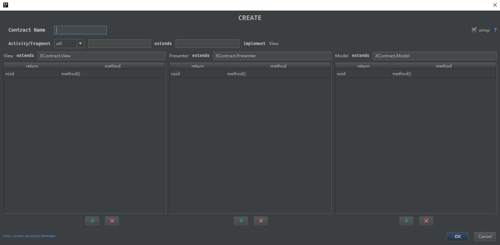
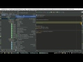
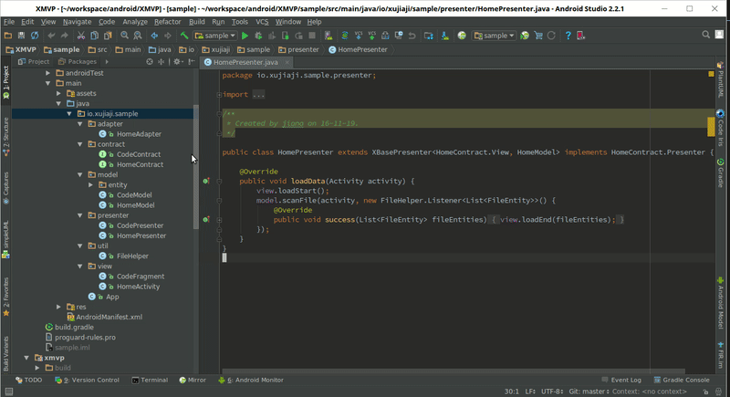
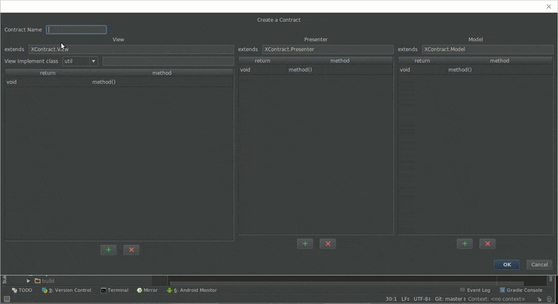
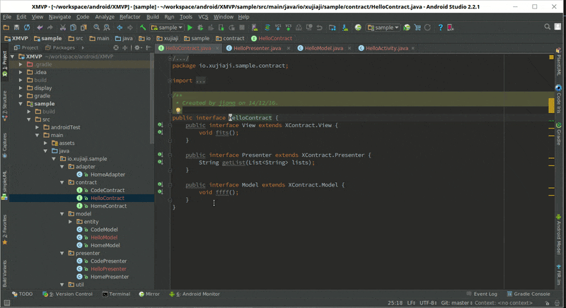
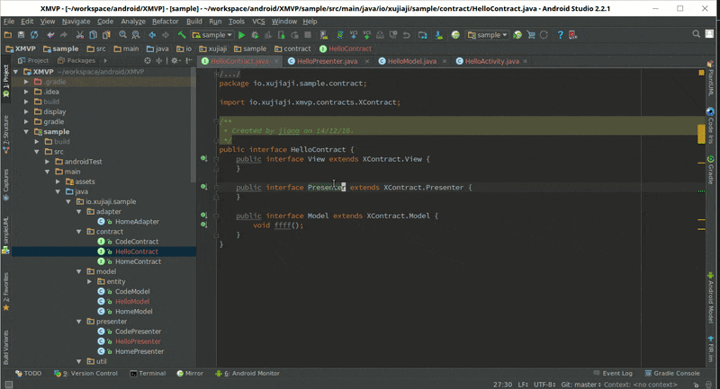

   

> 现在可以直接在intellij或Android studio里面直接搜索插件“MVPManager”进行安装。 

# 1.5.0更新
1. 优化界面
2. 添加自动继承XBasePresenter，当勾选xmvp时
3. 添加自动继承XBaseActivity或Fragment

### YouTube play：MVPManager use

### 优酷播放：MVPManager使用演示

# 安装MVPManager
 - 通过jar包
  1. 下载MVPManager jar包  
  2. File -> setting -> Plugin -> Install plugin from disk
  3. 选择您刚刚下载的jar包。
  4. 点击OK后重启就好了。

# Install MVPManager
 - By jar
  1. Download MVPManager jar 
  2. File -> setting -> Plugin -> Install plugin from disk
  3. Select the jar package you downloaded.
  4. OK then reboot Intellij/Android studio.
  
# 搭配xmvp library更加方便 / With xmvp library more convenient.
Address: https://github.com/xujiaji/XMVP

下面在编辑界面输入框中看到的XContract.View、XContract.Model、XContract.Presenter就是这个类库的。如果您不使用可以将输入框中的内容删除，添加您需要继承的父类接口，或者不继承父类接口。

# 开始编辑MVP代码 / Start edit MVP code.

# 修改MVP代码 / change MVP code.

# License
[MIT](LICENSE)
